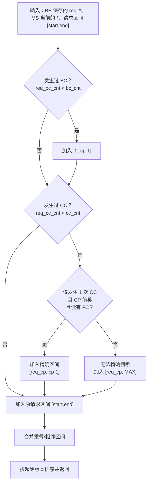

# `calc_sync_versions` 逻辑梳理

核心思路：在原请求版本区间之外，补充因 Compaction 被重写、需要重新同步的版本区间，最后合并重叠或相邻区间。

关键规则：

- **BC（Base Compaction）发生**：`cp` 之前的数据可能被整体重写，补 `[0, cp-1]`。
- **CC（Cumulative Compaction）发生**：
  - 仅一次 CC、`cp` 前移、且无 Full Compaction：可精确补 `[req_cp, cp-1]`。
  - 其他情况无法确定影响边界：保守补 `[req_cp, MAX]`，避免漏版本。
- 最终结果是：`压缩影响区间 ∪ 用户请求区间`。

调用方在进入该函数前已校验 `req_* <= 当前值`；返回区间随后用于读取并返回对应的 rowset meta。
