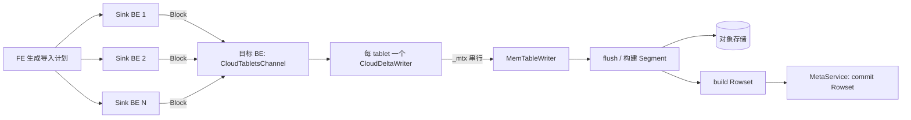
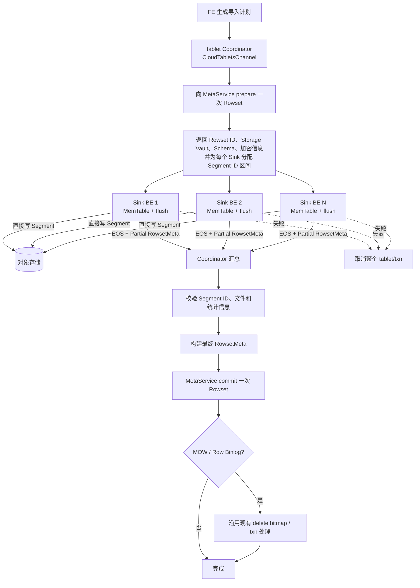

# Cloud MemTable-on-Sink 初步设计

## 1. 背景与目标

本文中的 MemTable-on-Sink 指 **MemTable 前移**：数据仍由 `OlapTableSink` 路由到目标
tablet，但 MemTable 的聚合、排序、flush 和 Segment 构建改在各个 Sink BE 上执行。它不是
迁移一个已经存在的 MemTable 对象。

当前 Cloud 路径即使有多个 Sink instance，同一 tablet 的 Block 最终仍汇聚到一个
`CloudDeltaWriter`：

```text
多个 Sink BE -> 一个 CloudTabletsChannel -> 一个 CloudDeltaWriter
                                           -> 一个 MemTableWriter -> S3
```

`CloudDeltaWriter::write()` 在 `_mtx` 内执行 backpressure 检查和 MemTable write。同一 tablet
的并发写入因此被串行化；bucket 越少、单 tablet 越大，这一问题越明显。MemTable 前移预期
解决：

- 将单 tablet 的 MemTable 聚合、排序、编码和 Segment 构建分散到多个 Sink BE；
- 消除多个 sender 在同一个 `CloudDeltaWriter::write()` 上的锁等待；
- 利用各 Sink BE 的 CPU 和内存带宽，提高少 bucket、大 tablet 导入吞吐；
- 由 Sink BE 直接写共享对象存储，避免再次把 Segment 数据汇聚到一个接收 BE。

它不解决对象存储带宽、MetaService 提交、数据倾斜和小导入固定开销。多 bucket 已经能把
写入分散到多个 writer，收益预计小于单 bucket 场景。

## 2. 当前链路

Cloud 模式目前显式跳过 `OlapTableSinkV2OperatorX`，继续发送 Block：



非 Cloud 的 MemTable-on-Sink 已有以下基础能力：

- `OlapTableSinkV2OperatorX` / `VTabletWriterV2` 在 Sink BE 上写 MemTable；
- `DeltaWriterV2` 在 Sink BE 上构建 Segment；
- `LoadStream` 将 Segment 文件和统计信息发送到目标 BE；
- 目标 BE 的 `LoadStreamWriter` 汇总并提交 Rowset。

但 `LoadStreamWriter` 当前构造的是本地 `RowsetBuilder`，并且直接调用本地
`commit_txn()`，不能原样用于 Cloud。

## 3. 初步方案

### 3.1 总体原则

采用“**多 Sink 写 Segment，单 Coordinator 提交 Rowset**”：

- FE 调度、数据分发和 Sink instance 保持不变；
- 复用 V2 Sink 的 MemTable、flush、backpressure 和 Segment writer；
- 每个产生 partial rowset 的 Sink writer 直接将 Segment 写入同一个 Cloud Rowset 的对象
  存储路径；同一 BE 内可继续复用现有 `DeltaWriterV2Pool`；
- 每个 tablet 只由一个现有的 `CloudTabletsChannel` 作为 Coordinator；
- Coordinator 只交换控制信息和 Segment 元数据，不接收 Block 或 Segment 文件内容；
- Coordinator 汇总完整 RowsetMeta，并沿用现有 Cloud build、delete bitmap 和提交生命周期。

不新增 worker 发现、任务派发和状态轮询。导入本身已经知道所有 sender，现有 open、close、
cancel 生命周期足以承担协调。

### 3.2 目标流程



### 3.3 Segment ID 分配

多个 partial writer 必须使用同一个 Rowset ID，但不能生成同名 Segment。复用并行 compaction
已经引入的“不连续 Segment ID”表示：

```text
Sink 0: 预留 [0, 1000)，实际生成 0、1、2
Sink 1: 预留 [1000, 2000)，实际生成 1000、1001
Sink 2: 预留 [2000, 3000)，实际生成 2000

最终 segment_ids = [0, 1, 2, 1000, 1001, 2000]
```

初版可按 partial writer ordinal 分配固定区间，单个区间容量使用
`max_segment_num_per_rowset`。这样任意一个 Sink 都能生成允许的全部 Segment，不需要预测
各 Sink 的数据量，也不需要逐 Segment 请求全局 ID。最终仍校验 **实际 Segment 数量** 不超过
`max_segment_num_per_rowset`，并校验 `start + capacity` 不溢出 `int32_t`。

每个 partial writer 使用 `set_segment_start_id(start, capacity)`。Coordinator 按 Segment ID
排序并同时重排以下逐 Segment 元数据，最后设置显式 `segment_ids`：

- `segment_num_rows`；
- encoded key bounds 及 truncated 标记；
- Segment 文件大小；
- inverted-index 文件信息；
- MOW delete bitmap 中引用的 Segment ID。

不能按照 sender 的完成顺序拼接元数据，因为异步完成顺序不稳定；`RowsetMeta` 要求显式
Segment ID 严格递增且不重复。

### 3.4 生命周期

每个 tablet 的状态由现有 Coordinator 独占：

1. **Open**：Coordinator 获取 tablet/schema/storage resource，创建 Rowset ID，并只调用一次
   `prepare_rowset()`。
2. **Assign**：通过现有 load open 响应向每个 partial writer 返回同一个 Rowset 上下文和
   独立 Segment ID 区间。
3. **Write**：Sink 使用本地 `MemTableWriter`，flush 后直接写对象存储；本地
   `MemTableMemoryLimiter` 继续负责限流。
4. **Partial close**：Sink 等待 flush 完成，返回实际生成的 Segment 列表和对应统计信息。
5. **Assemble**：Coordinator 等待所有 sender，校验并合并 partial metadata，构造一个最终
   Rowset。
6. **Commit**：复用当前 Cloud 路径的 build、MetaService commit、delete bitmap 和事务关联
   信息处理顺序；只有 Coordinator 可以提交。
7. **Cancel**：任一 sender 失败则取消整个 tablet/事务；prepared Rowset 的回收路径按
   Rowset 前缀删除对象，因此还需验证不连续 Segment 和并发上传下的迟到文件不会泄漏。

重试必须复用同一份 `(load_id, tablet_id, sender_id) -> rowset/slot` 分配，或者先明确终止旧
attempt 后创建新 Rowset，不能让两个 attempt 并发写同一 Segment 文件名。

## 4. 可复用代码与必要调整

| 能力 | 现状 | 初步处理 |
| --- | --- | --- |
| Sink 侧 MemTable | `VTabletWriterV2` + `DeltaWriterV2` 已实现 | 复用写入、flush、内存限流和 profile |
| Segment 流式协议 | `LoadStreamStub` 已有 open/close/EOS/失败传播 | 初版复用为控制和 metadata 通道，不再传文件内容 |
| Cloud Rowset 生命周期 | `CloudRowsetBuilder` 已实现 prepare/build/commit | 拆开 owner writer 与 partial writer；prepare/commit 只在 Coordinator |
| 分段 ID 区间 | `set_segment_start_id()` 已实现 | 按 Sink 分配互斥区间 |
| 不连续 Segment | `RowsetMeta.segment_ids` 及读取、回收路径已支持 | Coordinator 写入实际 ID 列表 |
| Partial meta 汇总 | 并行 compaction 已汇总 ID、rows、bounds、size、index | 抽取或复用最小公共逻辑，不复用 compaction 调度协议 |

需要注意，`BaseBetaRowsetWriter::_build_rowset_meta()` 当前只有 `TYPE_COMPACTION` 才记录
显式 Segment ID。Cloud load 的 partial writer 是 `TYPE_DIRECT`，需要让
`is_partial_output_writer` 在 direct load 下也记录实际 ID；同时禁止 partial writer 自行进行
可能重编号的 Segment compaction。

## 5. 主要难点

### 5.1 Rowset 所有权与一次提交

当前 `CloudRowsetBuilder` 同时拥有 prepare、writer、build 和 commit。前移后，一个 Rowset
对应多个 partial writer，但只能有一个 prepare 和一次 commit。需要明确 Coordinator 是
Rowset 的唯一 owner，Sink 只持有不可提交的写入上下文。

### 5.2 元数据一致性

最终 RowsetMeta 不是简单拼接 Segment ID。所有逐 Segment 数组必须按同一顺序对齐，并校验：

- ID 位于分配区间内、严格递增且全局不重复；
- rows、key bounds、file size、index info 数量与 Segment 数一致；
- 总行数、data/index/total size 等聚合值一致；
- 空输入仍能生成符合当前事务语义的空 Rowset。

### 5.3 MOW、partial update 与 delete bitmap

MOW 的 delete bitmap 依赖最终 Rowset、实际 Segment ID 和事务快照；partial update 还可能读取
历史行。多个 Sink 独立计算容易使用不同快照或产生重复覆盖。初版建议先支持 DUP、AGG 和
UNIQUE MOR 的全列导入；MOW/partial update 在 Coordinator 能基于最终 Rowset 复用现有
Cloud delete-bitmap 流程后再开启。

### 5.4 索引、Row Binlog 与组合 writer

倒排索引文件必须与 Segment ID 使用同一分配规则，并完整汇总 index file info。V1 inverted
index 和 partial update 已被现有 V2 Sink 排除，可以保持限制。Row Binlog 使用
`GroupRowsetWriter`，目前不支持 `set_segment_start_id()`；初版也应关闭，单独补齐 data/binlog
双 Rowset 的一致分配和原子提交后再支持。

### 5.5 对象存储写入与文件缓存

所有 Sink 必须获得相同的 Storage Vault、文件系统和加密配置，并写入同一个 Rowset 命名空间。
初版关闭 packed/merge file，避免多个 writer 共同维护一个聚合文件状态。直接写 S3 会把上传
并发度从目标 BE 扩散到所有 Sink BE，需要保留 S3 队列 backpressure，防止吞吐提高但对象
存储请求数和内存失控。

### 5.6 失败、重试和垃圾回收

对象文件可能在事务提交前已经生成。需要验证取消、超时、BE 重启、重复 EOS 和 Coordinator
切换时：

- 不会提交缺少任一 sender 的 Rowset；
- 重复请求不会重复计数或覆盖仍在写入的文件；
- 未提交 Rowset 的 Segment 能被现有回收流程识别；
- 已提交 Rowset 不会因迟到的 cancel 被删除。

### 5.7 内存与负载转移

前移不会减少总 MemTable 工作，只是把工作从目标 BE 分散到 Sink BE。单 tablet 锁等待会
下降，但查询/导入 BE 的峰值内存和 CPU 会增加。必须复用 Workload Group、MemTable limiter
和取消机制，不能只解除锁而缺少全局 backpressure。

## 6. 分阶段落地

### 第一阶段：验证主路径

- 仅 Cloud、全列导入；支持 DUP、AGG、UNIQUE MOR；
- 关闭 MOW、partial update、row binlog、V1 inverted index 和 packed file；
- 一个 CloudTabletsChannel 负责 prepare、汇总和 commit；
- Sink 直接写对象存储，使用固定 Segment ID 区间；
- 保留会话开关，可按不支持的 schema 回退现有 Cloud sink。

### 第二阶段：补齐能力

- inverted index V2 完整校验；
- MOW delete bitmap；
- partial update；
- row binlog/group writer；
- 根据实测决定是否需要动态扩展 Segment ID 区间或 packed file。

不要先实现动态 worker 发现、集中式 Segment ID RPC 或新的任务轮询框架；现有 sender 集合和
固定区间已经覆盖第一阶段。

## 7. 验证指标

性能测试至少比较 1、2、8 bucket，并固定输入、并发和对象存储环境。重点观察：

- 导入端到端耗时、rows/s、MiB/s；
- 各 BE 的 CPU 核利用率和内存峰值；
- 当前 `CloudDeltaWriter` 的 write lock wait/hold 是否消失或显著下降；
- Sink 侧 MemTable write、flush、Segment build 的耗时与并行度；
- S3 写吞吐、请求数、上传线程池队列和网络吞吐；
- Coordinator assemble、MetaService commit 和 delete bitmap 耗时；
- 生成 Rowset 的行数、校验值、Segment/索引可读性以及 abort 后垃圾回收。

预期最明显的收益是单 bucket、大输入、多 Sink instance 场景。验收不能只看锁等待下降：如果
端到端耗时转而由 S3 或内存 backpressure 主导，应以总吞吐和资源成本判断是否值得默认开启。
