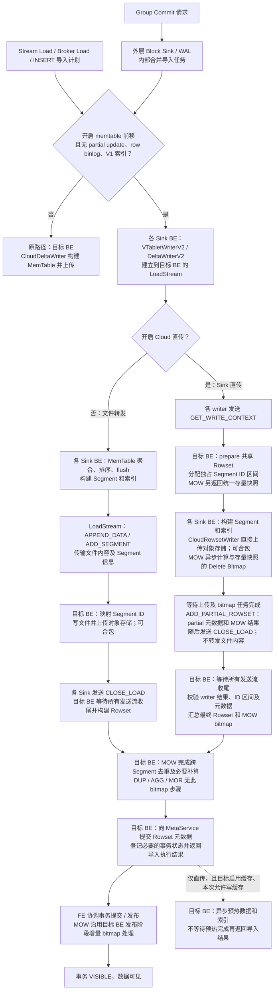
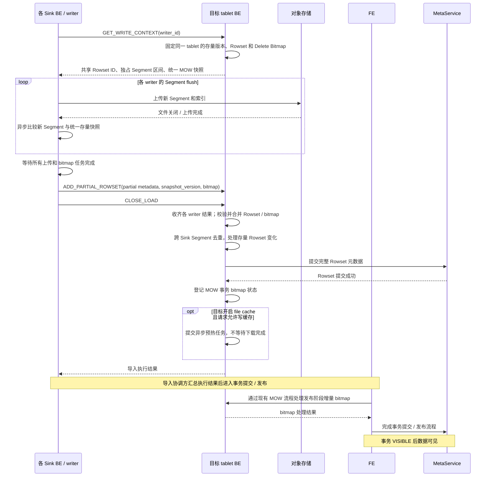

# Cloud MemTable-on-Sink 与 Segment 直传

## 1. 背景与目标

本文中的 MemTable-on-Sink 指 **MemTable 前移**：数据仍由 `OlapTableSink` 路由到目标
tablet，但 MemTable 的聚合、排序、flush 和 Segment 构建改在各个 Sink BE 上执行。它不是
迁移一个已经存在的 MemTable 对象。

改造前的 Cloud 路径即使有多个 Sink instance，同一 tablet 的 Block 最终仍汇聚到一个
`CloudDeltaWriter`：

```text
多个 Sink BE -> 一个 CloudTabletsChannel -> 一个 CloudDeltaWriter
                                           -> 一个 MemTableWriter -> S3
```

`CloudDeltaWriter::write()` 在 `_mtx` 内执行 backpressure 检查和 MemTable write。同一 tablet
的并发写入因此被串行化；bucket 越少、单 tablet 越大，这一问题越明显。MemTable 前移预期
解决：

- 将单 tablet 的 MemTable 聚合、排序、编码和 Segment 构建分散到多个 Sink BE；
- 消除多个 sender 在同一个 `CloudDeltaWriter::write()` 上的锁等待；
- 利用各 Sink BE 的 CPU 和内存带宽，提高少 bucket、大 tablet 导入吞吐；
- 由 Sink BE 直接写共享对象存储，避免再次把 Segment 数据汇聚到一个接收 BE。

它不解决对象存储带宽、MetaService 提交、数据倾斜和小导入固定开销。多 bucket 已经能把
写入分散到多个 writer，收益预计小于单 bucket 场景。

### 1.1 当前实现范围

Cloud MemTable 前移支持 DUP、AGG 和 UNIQUE MOR/MOW 表全列导入，沿用 V2 Sink 对 partial update、
row binlog 和 V1 inverted index 的限制。MOW 关闭直传时转发文件，由目标 BE 计算 Delete Bitmap。
转发路径在串行接收线程中取得已关闭文件的 Rowset 元数据快照，再异步计算存量 bitmap，
避免后续文件关闭时更新 packed 映射与 bitmap 任务读取元数据并发。跨 Segment 去重、
存量 Rowset 变化补算和发布继续使用目标 BE 的现有流程。

不再通过 FE 下发的表模型字段做兼容性准入；实际写入模型由 tablet schema 确定。
MOW 直传要求目标 BE 返回完整的统一快照，缺少快照或必要字段时，在上传前报错。
AGG 在 sink 内聚合，跨 Segment/Rowset 的聚合与 MOR 去重仍由现有读取和 compaction 完成。
Segment ID 是物理文件身份，不代表业务更新顺序；MOR 保留原有版本、Sequence 和相同值
冲突处理规则。需要表达业务更新先后时使用 Sequence，不能依赖并行导入的文件行顺序。

支持两条路径：

```text
转发：Sink BE 构建 Segment -> LoadStream 传文件 -> 目标 BE 上传对象存储并提交 Rowset
直传：Sink BE 构建并上传 Segment -> LoadStream 传部分元数据 -> 目标 BE 汇总并提交 Rowset
```

文件转发路径要求保留默认的 `share_delta_writers=true`：接收端按源 BE 与本地 Segment ID
映射文件，同一 BE 的独立 writer 会重复使用本地 ID。直传通过独立 writer 区间支持关闭共享。

SQL 会话的前移开关默认开启，直传开关默认关闭；显式启用两者：

```sql
SET enable_memtable_on_sink_node = true;
SET enable_cloud_memtable_direct_upload = true;
```

Stream Load 使用 FE 动态配置 `stream_load_default_cloud_memtable_direct_upload`，默认
`true`；仍需通过 `memtable_on_sink_node` 请求参数或已有 FE 默认配置开启 MemTable 前移。
新增配置不改变非 Cloud 导入。

直传需要参与导入的 BE 及 MetaService、Recycler 均支持当前分支的显式 Segment ID 格式。
不再通过 open 响应进行直传能力握手。
同一 tablet 的模式在写入开始后固定，不能混用直传与文件转发。

### 1.2 Cloud 前移总流程

以下按提交 `1a7bd0af` 描述。Sink BE 是执行导入 Sink 的 BE，目标 BE 是负责该 tablet
写入与 Rowset 提交的 BE，两者可以位于同一进程。图中“多个 Sink”表示可并行的执行位置，
不保证一次导入一定使用三个 BE；同一 tablet 最终仍由目标 BE 汇总提交。



Group Commit 内部任务使用 FE 的 `stream_load_default_memtable_on_sink_node` 和
`stream_load_default_cloud_memtable_direct_upload` 默认配置。`async_mode` 的外层请求可在
WAL 确认后返回，不能将该返回视为图中的事务 VISIBLE。Rowset 元数据提交也不等于事务可见，
预热与后续事务提交/发布可并行进行。

### 1.3 MOW 直传的职责划分



统一快照上的存量比较分散到 Sink BE；跨 Sink 冲突和快照之后的增量仍由目标 BE 处理。
AGG 的跨 Segment 聚合、MOR 的跨 Segment 去重不在这个 MOW bitmap 流程中，继续使用现有
读取与 compaction 语义。

## 2. 写入与提交

1. Sink 继续使用 `VTabletWriterV2`、`DeltaWriterV2`、MemTable、flush 和现有内存限流。
2. 每个独立 DeltaWriter 首次写入时，通过 `GET_WRITE_CONTEXT` 获取该 tablet 的上下文。
   目标 BE 复用 `TabletStream / LoadStreamWriter / CloudRowsetBuilder`，prepare 一次 Rowset。
3. 返回共享 Rowset ID、storage resource、事务过期时间、索引格式、加密及缓存配置，以及独立
   Segment ID 区间。writer 身份独立于 BE 和 stream，兼容同一 BE 上不共享 DeltaWriter 的情况。
4. Sink 通过 `RowsetFactory` 创建 `CloudRowsetWriter`，复用对象存储 writer 和上传队列。
   不调用 `CloudTablet::create_rowset_writer()`，因为后者会重新分配 Rowset ID。
5. Sink 等待全部 flush 和文件关闭成功，build partial RowsetMeta，然后发送 `ADD_PARTIAL_ROWSET`。
   该消息和现有 `CLOSE_LOAD` 复用同一有序 stream，文件内容不再经过目标 BE。
6. 目标 BE 等所有 stream 关闭，确认每个注册 writer 均提交结果，按物理 Segment ID 顺序
   汇总元数据，构建一个最终 Rowset，然后沿用现有 Cloud Rowset 提交和 FE 事务发布流程。

目标 BE 是 Rowset 唯一提交者；Sink 不 prepare、commit 独立 Rowset，不新增协调服务或轮询。

### 2.1 代码调用关系：入口与目标端 Builder 创建

下面的调用树对应当前实现。`→` 表示调用或创建，`⇒` 表示跨 BE RPC/stream 消息，
`[异步]` 表示在线程池任务中执行；省略错误处理和部分中间封装，不表示完整的同步调用栈。
文件转发和直传都复用目标端 `LoadStreamWriter`，区别在于传入的是文件内容还是上传后的元数据。

```text
Sink BE
PipelineFragmentContext::_create_data_sink()
  → OlapTableSinkV2OperatorX
    → AsyncWriterSink<VTabletWriterV2, OlapTableSinkV2OperatorX>
      → VTabletWriterV2::open()
        → _init()：获取 DeltaWriterV2Map / LoadStreamMap
        → _open_streams()
          → _open_streams_to_backend()
            → LoadStreamStubs::open()
              → LoadStreamStub::open()
                ⇒ PInternalService::open_load_stream()                     [目标 BE]
                  → LoadStreamMgr::open_load_stream()
                    → LoadStream::init()：创建各 index 的 IndexStream

后续消息到达目标 BE
LoadStream::_dispatch()
  → _append_data()
    → IndexStream::append_data()
      → _init_tablet_stream()                                             [该 tablet 首次消息]
        → TabletStream::init()
          → 创建 LoadStreamWriter
            → engine.create_rowset_builder()
              ├─ CloudStorageEngine::create_rowset_builder()
              │   → CloudRowsetBuilder                                   [Cloud]
              └─ StorageEngine::create_rowset_builder()
                  → RowsetBuilder                                        [存算一体]
          → LoadStreamWriter::init()
            → CloudRowsetBuilder::init()                                  [以下为 Cloud]
              → CloudTablet::create_rowset_writer()
                → RowsetFactory::create_rowset_writer()
                  → CloudRowsetWriter
              → CloudMetaMgr::prepare_rowset()                            [需 prepare 时]
      → TabletStream::append_data()：分发当前消息
```

`CloudRowsetBuilder` 负责目标端的 Rowset 生命周期。Sink 直传也会创建一个
`CloudRowsetWriter`，但不经过目标端这个 Builder 工厂，见下一节。

### 2.2 代码调用关系：Sink 写 MemTable 与两条 flush 路径

```text
VTabletWriterV2::write()
  → 数据按 tablet 路由
  → _write_memtable()
    → DeltaWriterV2Map::get_or_create()
      → DeltaWriterV2::create_unique()                                    [首次创建 writer]
    → DeltaWriterV2::write()
      → init()                                                           [首次写入时延迟初始化]
        ├─ 文件转发：创建 BetaRowsetWriterV2
        └─ Sink 直传：_init_direct_upload_writer(context)
            → LoadStreamStub::register_direct_upload_writer()
              ⇒ GET_WRITE_CONTEXT                                        [目标端见 2.3]
              ← 共享 Rowset 元数据、独占 Segment ID 区间及 MOW 快照
            → _init_direct_mow_context()                                 [仅 MOW]
            → RowsetFactory::create_rowset_writer()
              → CloudRowsetWriter                                        [Sink 本地对象]
            → RowsetWriter::set_segment_start_id()
        → MemTableWriter::init(rowset_writer, ...)
      → MemTableWriter::write()
        → MemTable::insert()
        → _flush_memtable_async()                                        [达到 flush 条件或收尾]
          → FlushToken::submit()
            → [异步] FlushToken::_flush_memtable()
              → _flush_memtable_impl()
                → RowsetWriter::flush_memtable()                          [虚调用]
                  ├─ 文件转发：BetaRowsetWriterV2::flush_memtable()
                  │   → SegmentCreator 构建 Segment / 索引
                  │   → BetaRowsetWriterV2::create_file_writer()
                  │     → io::StreamSinkFileWriter
                  │       → appendv() / close()
                  │         → LoadStreamStub::append_data()
                  │           ⇒ APPEND_DATA（含文件结束标志）
                  │   → BetaRowsetWriterV2::add_segment()
                  │     → LoadStreamStub::add_segment()
                  │       ⇒ ADD_SEGMENT
                  └─ Sink 直传：CloudRowsetWriter 及现有 SegmentCreator 路径
                      → 创建对象存储文件 writer；按配置使用 packed
                      → S3 文件写入 / 上传队列
                      → [MOW 异步任务] 与统一存量快照计算 Delete Bitmap
```

转发时 `BetaRowsetWriterV2` 的文件 writer 发送字节；直传时 Sink 的 `CloudRowsetWriter`
写对象存储。两者都在 Sink 执行 MemTable flush，目标端不会重新把这些输入行写入 MemTable。

### 2.3 代码调用关系：目标端消息分发

以下消息均经过 `LoadStream::_dispatch() → _append_data() →
IndexStream::append_data() → TabletStream::append_data()`。

```text
TabletStream::append_data()
  ├─ GET_WRITE_CONTEXT                                                   [直传注册]
  │   → LoadStreamWriter::register_direct_upload_writer(writer_id)
  │     → 记录 / 复用 writer 的 Segment ID 区间
  │     → CloudRowsetBuilder::get_mow_snapshot_for_sink()                    [仅 MOW]
  │     → 填充 PCloudLoadWriteContext
  │   ⇒ PLoadStreamResponse.write_context 返回 Sink
  │
  ├─ ADD_PARTIAL_ROWSET                                                  [直传上传完成]
  │   → LoadStreamWriter::add_partial_rowset()
  │     → CloudRowsetBuilder::validate_partial_rowset_meta()
  │     → CloudRowsetBuilder::merge_sink_mow_bitmap()                    [仅 MOW]
  │     → 保存该 writer 的 partial Rowset 元数据
  │
  ├─ APPEND_DATA                                                         [文件转发]
  │   → 映射源 BE / Segment ID
  │   → [接收端 flush 任务] LoadStreamWriter::append_data() / close_writer()
  │     → 目标端 RowsetWriter 创建文件 writer
  │     → 写入 / 关闭对象存储文件，收集 packed 映射
  │
  └─ ADD_SEGMENT                                                         [文件转发]
      → TabletStream::add_segment()
        → [接收端 flush 任务] LoadStreamWriter::add_segment()
          → 记录 Segment 统计，触发必要的 MOW 存量 bitmap 计算
```

### 2.4 代码调用关系：收尾、提交与预热

```text
Sink BE：VTabletWriterV2::close()
  → DeltaWriterV2Map::close()                                             [最后一个使用者]
    → 各 DeltaWriterV2::close()
      → MemTableWriter::close()：提交剩余 MemTable flush
    → 各 DeltaWriterV2::close_wait()
      → MemTableWriter::close_wait()：等待 flush 完成
      → [直传] _finish_direct_upload(profile)
        → RowsetWriter::build(partial)
        → [MOW] build 内等待 bitmap 任务，随后构建 PCloudLoadMowResult
        → LoadStreamStub::add_partial_rowset()
          ⇒ ADD_PARTIAL_ROWSET
  → LoadStreamMap::close_load()                                           [按共享和增量流收尾规则]
    → LoadStreamStub::close_load()
      ⇒ CLOSE_LOAD

目标 BE：LoadStream::_dispatch(CLOSE_LOAD)
  → LoadStream::close()                                                  [收齐所需 CLOSE_LOAD 后]
    → IndexStream::close()
      → TabletStream::pre_close() / close()
        → LoadStreamWriter::_pre_close()
          ├─ 直传：CloudRowsetBuilder::assemble_rowset_meta_from_partials()
          │         → build_rowset_from_assembled_meta()
          └─ 转发：BaseRowsetBuilder::build_rowset()
          → BaseRowsetBuilder::submit_calc_delete_bitmap_task()
        → LoadStreamWriter::close()
          → BaseRowsetBuilder::wait_calc_delete_bitmap()
          → CloudRowsetBuilder::commit_txn()
            → commit_rowset()
              → CloudMetaMgr::commit_rowset() ⇒ MetaService
            → set_txn_related_info()：登记 MOW 等事务状态
          → [直传且满足缓存条件] CloudWarmUpManager::warm_up_rowset()
            → [异步] 目标 BE 缓存预热，不等待完成
  ⇒ 返回执行结果，Sink 等待 stream 收尾
  → 后续由导入协调方 / FE 进入事务提交发布；Rowset 提交不等于事务 VISIBLE
```

相关源码入口：

- [Sink 路由与收尾](be/src/exec/sink/writer/vtablet_writer_v2.cpp)、
  [DeltaWriterV2 初始化与写入](be/src/load/delta_writer/delta_writer_v2.cpp)。
- [Sink 端 LoadStreamStub](be/src/exec/sink/load_stream_stub.cpp)、
  [目标端 LoadStream / IndexStream / TabletStream](be/src/load/channel/load_stream.cpp)。
- [目标端 LoadStreamWriter](be/src/load/channel/load_stream_writer.cpp)、
  [Cloud Builder 工厂](be/src/cloud/cloud_storage_engine.cpp)、
  [CloudRowsetBuilder](be/src/cloud/cloud_rowset_builder.cpp)。

## 3. Segment ID 与元数据

writer 按首次注册顺序取得独占区间，容量在首次注册时固定为
`max_segment_num_per_rowset`。区间只保留编号，不创建预留对象。

```text
writer A: [0, 1000)，实际写 0、1
writer B: [1000, 2000)，实际写 1000、1001
最终 segment_ids = [0, 1, 1000, 1001]，num_segments = 4
```

使用现有 `set_segment_start_id()` 分配 ID。direct load 的 partial writer 持久化显式 ID，
保留逐 Segment key bounds，并关闭可能重新编号的 Segment compaction。最终实际 Segment
总数仍受 Rowset 上限约束。

目标 BE 校验 Rowset/tablet/txn/load/storage 身份、ID 区间、数组对齐、行数和大小统计。
汇总数据包括 Segment ID、行数、文件大小、key bounds、V2 index file info 和 packed slice
映射；Variant schema 使用现有 schema 合并逻辑。接收端不会把稀疏 ID 传给依赖连续编号的
文件接收 writer。

## 4. Packed file 与缓存

转发路径保留目标 BE 合包。直传路径使用 Sink BE 本机的 PackedFileManager，无需跨 BE
共享 packed writer。

保持整个 Rowset 的物理 Segment 0 及其 V2 索引参与合包的策略；其他 Segment 独立上传。
仍受现有 packed 开关和小文件阈值控制。不会把每个 writer 的区间起点都视作可合包首段。

上传者等待文件关闭后收集实际 packed slice 位置，将逻辑文件路径到 packed object/offset/size
的映射放入 partial metadata。目标 BE 校验逻辑路径归属并写入最终 RowsetMeta，不能从目标
BE 本机的 PackedFileManager 查询远端上传者的映射。

目标 BE 开启 file cache 且本次导入允许写缓存时，在完整 Rowset 元数据提交成功后，使用
现有预热线程池异步缓存数据文件和索引，支持 packed slice 及非连续 Segment ID，无需配置
event-driven warmup job。预热遵循 `file_cache_enable_only_warm_up_idx` 等现有预热策略。
导入不等待预热完成；下载失败沿用现有预热日志和指标，后续读取仍可按需填充缓存。

目标 BE 通过 writer context 的 `warm_up_file_cache` 标记告知本次直传是否启用预热；
该标记为 true 时，异机 Sink BE 关闭本次直传输出的缓存写入，
包括 adaptive cache admission；MOW 读取旧数据的缓存行为不变。Sink 与目标位于同一 BE 时，
保留上传时的缓存策略。Sink 的 `write_file_cache` 直接使用本地写入请求值，不再由目标端
回传；目标端仍通过 open 请求接收该值。预热发生在 Rowset 提交后，
不改变事务可见性，也不保证导入返回时缓存已就绪。直传降低 BE 间文件传输，但不会降低对象
存储总写入量，异机目标预热会增加对象存储读取流量。

## 5. 失败与重试

- 重复获取同一 writer 上下文返回原区间；相同 partial 结果重发不重复计数，冲突结果报错。
- 缺少任一注册 writer 的结果、上传失败、元数据错误或事务过期，均不得提交完整 Rowset。
- 取消沿用 MemTable flush token 和 LoadStream 生命周期，等待本机 flush 任务退出。
- 已上传但未提交的文件沿用 prepared Rowset 前缀回收；packed 对象沿用现有独立 slice 回收。
- 不支持协调者透明接管，也不支持并发重放同一对象路径；失败后由现有导入/事务层发起新
  attempt，分配新 Rowset 身份。

## 6. 验证

`test_cloud_duplicate_memtable_on_sink` 对照转发和直传路径，覆盖三 BE S3 导入、多个 Segment、
V2 索引及 packed 映射持久化、关闭文件缓存读取、重复 partial 结果、Stream Load 和上传后失败。
直传测试通过 debug point 拒绝目标 BE 接收文件内容。两个用例均从 MetaService 获取 Rowset
布局并记录实际 Segment ID、逐段行数和文件大小；packed 对照还将完整 ID 列表写入测试结果。

`test_cloud_memtable_direct_upload_unshared` 覆盖关闭 DeltaWriter 共享、关闭 packed、多 Sink
导入同一 tablet，以及空输入和多个导入事务。

`CloudDirectUploadMetaTest` 及 LoadStream 单测覆盖稀疏 ID 元数据汇总、序列化、越界/错位/统计
异常、空 writer、重复结果和缺失结果。性能默认开启与否应另行通过 RELEASE benchmark 决定。

`test_cloud_memtable_agg_mor` 对照转发与直传，覆盖 AGG 聚合状态、REPLACE/REPLACE_IF_NOT_NULL、
MOR 带/不带 Sequence、跨 sink 重复 key、低 Sequence 后写、空输入、索引读取、packed 布局、
Broker Load、Stream Load、delete sign、重插入和 compaction 前后结果，以及 MOW 文件转发。

`test_cloud_memtable_mow_forward` 覆盖 MOW 文件转发的普通/packed 文件、V2 索引、
存量与跨 Sink 重复 key、Sequence、删除重插、Stream Load、异步 Group Commit 和 compaction。

## 7. MOW 直传

目标 BE 为同一 tablet 的全部 writer 固定一个存量快照：可见版本、Rowset 元数据和对应
Segment 在该版本聚合后的 delete bitmap。快照在元数据同步锁和 tablet header 锁下取得，
存量 Rowset 引用保留到导入结束；writer 注册沿用已有有序 LoadStream。

各 Sink 随 Segment flush 向已有 bitmap 线程池提交异步任务，关闭该文件后用
`calc_delete_bitmap()` 比较新 Segment 与统一存量快照。收尾等待任务完成并汇总
`PCloudLoadMowResult`，不转发 Segment 内容。
目标校验快照版本和 bitmap 完整性，相同结果重发不重复计数，冲突结果使导入失败。

目标汇总 partial Rowset 和 bitmap，再计算跨 Sink Segment 的重复 key，并用现有提交阶段
逻辑补算存量 Rowset 集合的变化。完成后登记 Cloud 事务 bitmap 缓存，沿用 FE 的 MOW 锁、
发布版本分配和 bitmap 持久化流程。存量比较使用 Sequence；bitmap 始终引用实际物理
Segment ID。目标统一处理跨 Sink 去重，因此不需要重新 shuffle 相同 key。

Sink 只保留到上传和初始 bitmap 计算完成，发布阶段的增量由目标 BE 处理。快照下发及
存量主键索引读取带来额外开销，收益需要按存量规模和导入大小测量。当前不支持 partial
update、row binlog、V1 索引，以及在取得快照时正处于 schema change 的 tablet。

`test_cloud_memtable_mow` 覆盖不共享 writer、存量删除状态、稀疏 ID、Sequence、跨 Sink
重复 key、packed、V2 索引、Stream/Broker Load、删除后低 Sequence 写入、compaction，
以及固定快照后并发写入并替换存量 Rowset、bitmap 计算失败事务不可见。
