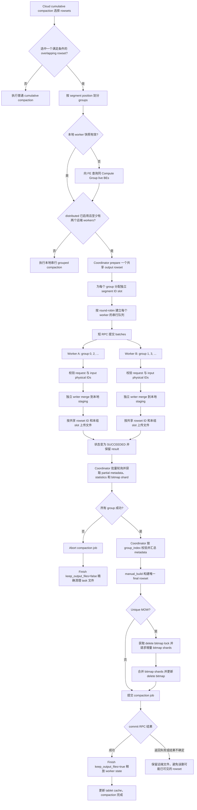
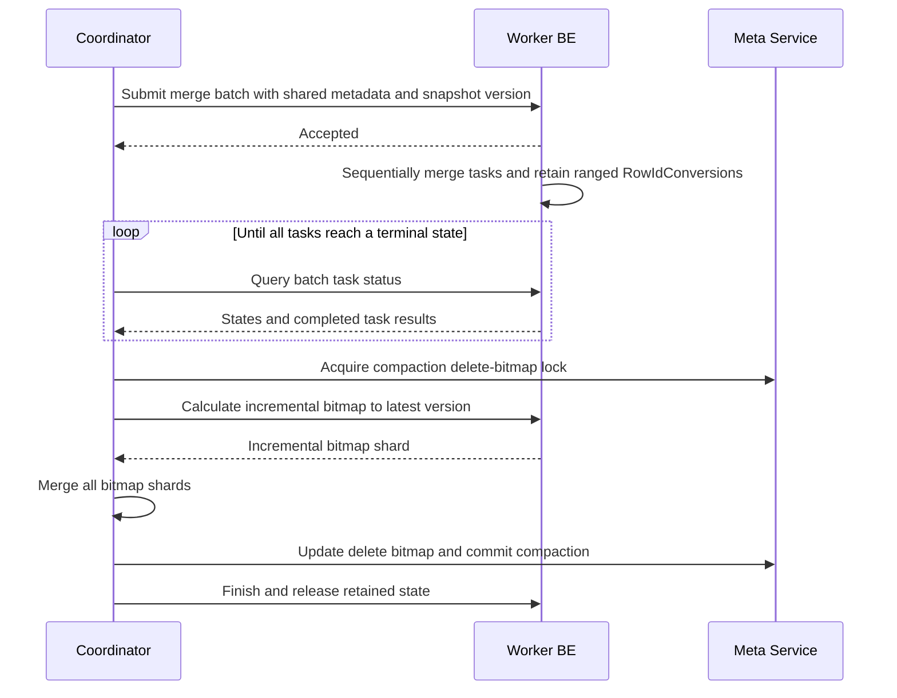
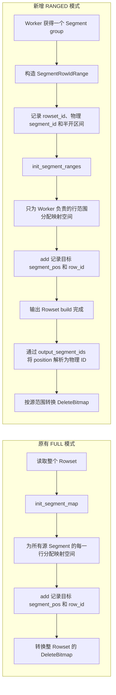
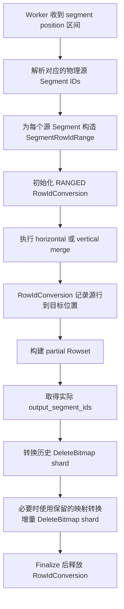
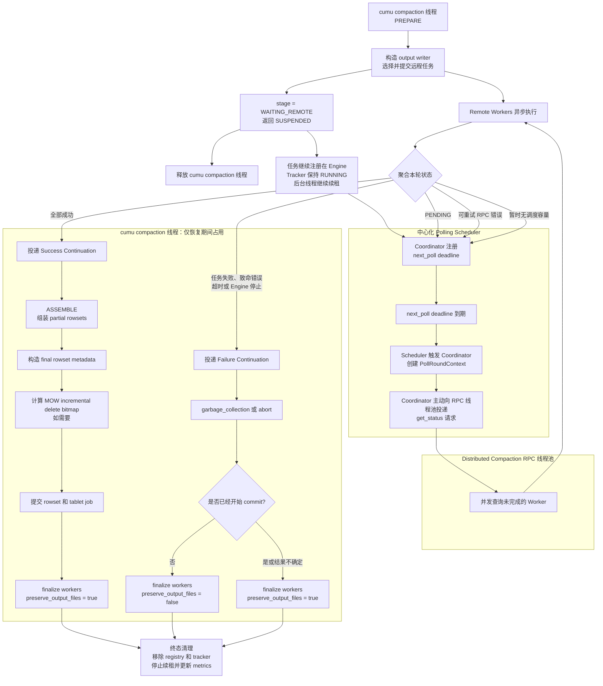

# Distributed Single-Rowset Compaction 核心设计

## 1. 背景与目标

Cloud cumulative compaction 可能选中一个包含大量 overlapping segments 的 rowset。原有
single-rowset grouped compaction 会把这些 segments 按固定大小切成多个 group，但所有
group 都在 coordinator BE 上串行执行。对于 segment 数较多、单个 group 可以独立 merge
的场景，这会使单机 CPU、内存和对象存储带宽成为瓶颈。

本功能把一个 rowset 内的 group 分发到多个远端 BE：

- 不拆分单个 segment，只以 segment group 为最小任务单位。
- 不同 worker BE 并行，同一个 worker BE 上的多个 group 串行。
- 所有 group 共享一个最终 output rowset ID，但使用互不重叠的物理 segment ID slot。
- worker 只负责 merge 和上传 partial output；最终 metadata、delete bitmap 和 rowset commit
  只由 coordinator 完成。
- 支持 Duplicate、Aggregate、Unique MOW、Unique MOR、horizontal/vertical merge 和
  inverted index。

该设计的关键不是简单地把 merge RPC 化，而是保证多个 BE 产生的文件可以安全、确定地
组成一个 rowset，并且在成功、失败和提交结果不确定时都不会误删数据。

## 2. 核心不变量

### 2.1 只有一个提交者

Coordinator 是 compaction job 和最终 rowset 的唯一所有者：

- 只 prepare 一次 output rowset。
- 只构建一次 final rowset metadata。
- 只更新一次 MOW delete bitmap。
- 只向 Meta Service commit 一次 compaction job。

Worker 不 prepare、commit 或发布 partial rowset，因此不存在多个 BE 竞争提交同一版本的
问题。

### 2.2 Segment position 与物理 segment ID 分离

输入 group 用 position 范围描述：

```text
[segment_pos_start, segment_pos_end)
```

position 是 rowset metadata 数组的下标；物理 segment ID 决定数据文件、索引文件、
file cache 和 delete bitmap 的身份。对于带显式 `segment_ids` 的 rowset，两者不一定
相等。

Coordinator 在请求中同时发送 position 范围和对应的物理 ID list。Worker 会逐项校验：

```text
input_rowset.segment(position).id == request.input_segment_ids[offset]
```

这样可以避免把 position 错当成物理 ID，尤其适用于经过 grouped compaction 后物理 ID
不连续的 rowset。

### 2.3 Group 输出必须互不覆盖

所有 group 共用最终 rowset ID。Coordinator 为每个 group 预留固定容量的 segment ID
slot：

```text
group i slot = [base + i * capacity, base + (i + 1) * capacity)
```

例如 `base=35`、`capacity=100`：

```text
group 0 -> [35, 135)
group 1 -> [135, 235)
group 2 -> [235, 335)
```

每个 worker writer 只能从自己的 slot 分配 ID。输出 segment 数超过容量时整个 task
失败，不能侵入相邻 group 的范围。最终物理 ID 可以有空洞，但不会冲突。

### 2.4 最终顺序由 plan 决定

Group 可能乱序完成，但 coordinator 始终按 `group_index` 汇总。最终 metadata 的顺序是：

```text
group 0 segments + group 1 segments + ... + group N segments
```

完成顺序、worker endpoint 和线程调度均不能影响最终 rowset 布局。

## 3. 角色与状态

### Coordinator BE

Coordinator 负责：

1. 选择一个满足 grouped-compaction 条件的 overlapping rowset。
2. 按 segment position 生成 group ranges。
3. prepare 共享的 output rowset，并分配 segment ID slots。
4. 选择远端 workers，异步提交 merge batch 并批量轮询任务状态。
5. 校验和汇总 partial rowset metadata、统计信息以及 MOW bitmap shards。
6. 构建 final rowset，更新 delete bitmap，提交 compaction job。
7. 通知 workers 保留或删除远端输出，并释放 retained state。

### Worker BE

每个 task 在 worker 上对应一个
`DistributedSingleRowsetCompactionWorker`，以三元组作为唯一键：

```text
(execution_id, group_index, attempt_id)
```

Worker state 保留：

- tablet 和独立的 compaction memory tracker；
- 本地 staging partial rowset；
- 已上传的物理 segment ID list 和 remote rowset metadata；
- MOW 场景下的 ranged `RowIdConversion`。
- `PENDING/RUNNING/SUCCEEDED/FAILED` 状态和最终 task result。

这些状态必须保留到 coordinator 完成 MOW 增量 delete bitmap 计算，或收到 finish RPC。

## 4. 调度模型

只有以下条件同时满足时才进入分布式路径：

- 已启用 cloud single-rowset grouped compaction。
- 已启用 distributed single-rowset compaction。
- 至少存在两个 segment groups。
- FE 返回的同 Compute Group live 节点中，至少有两个远端 worker。

Worker 列表不再由静态 endpoint 配置提供。Coordinator 在首次需要分布式执行或本地缓存
过期时，使用自己的 backend ID 向 FE master 查询。FE 根据 requester 反查 Compute Group，
只返回同组、alive、未退役且 BRPC 可用的其他 BE。BE 将结果缓存为短 TTL 的不可变快照；
FE 查询失败时本次回退本地 grouped compaction，worker RPC 失败时立即使快照失效。

Coordinator 将 group 按 round-robin 分配给 workers：

```text
worker_index = group_index % worker_count
```

Coordinator 把分配给同一 endpoint 的 group 放入一个 batch submit RPC。Worker 只在 batch
成功进入独立 worker thread pool 后返回；Coordinator 随后用短 RPC 批量查询该 endpoint
上的 task 状态。Worker 按 group_index 顺序执行 batch 中的 tasks。这样既避免长时间占用
RPC 连接和 coordinator RPC 线程，也避免重复传输共享 rowset metadata，并保持同一 BE 上的
串行 merge 语义。

```text
worker A: group 0 -> group 2 -> group 4
worker B: group 1 -> group 3 -> group 5
```

Submit RPC 遇到 transport error 或过载时可用相同 task key 重试，Worker 将其作为幂等提交
返回已有状态，不会重复执行。当前 merge task 本身不自动重试，`attempt_id` 固定为 0，仅为
后续安全 retry 预留协议身份。
如果尚未启动远程任务时不满足分布式条件，继续走原有本地串行 grouped compaction；任何
远程 task 启动后的失败都会中止本次 compaction，不会中途切换执行模式。

## 5. 端到端流程图



## 6. Worker 执行过程

### 6.1 Request 校验

Merge batch RPC 的公共部分携带：

- tablet 和 execution 身份；
- 完整 input/output rowset metadata；
- 共享 output rowset ID；
- 目标 backend ID、cloud unique ID 和 Compute Group ID；
- horizontal/vertical、MOW 等共享执行参数。

每个 task 只携带 group、attempt、输入 position 范围、物理 segment IDs、merge way 和本组
output segment slot。Worker 收到一个 batch 后先校验并复制 request，在任务确实进入 worker
pool 后立即返回。后台线程按 task 顺序执行；第一个 task 失败后，剩余 tasks 标记为失败且
不执行 merge。

Worker 校验目标节点身份、Compute Group、metadata、tablet ID、rowset ID、输入范围、物理
ID list、MOW 模式以及 slot 边界。相同 task key 的重复 submit 返回已有任务状态，防止同一
slot 被两个 writer 同时写入。

### 6.2 Partial writer

每个 group 创建独立 `RowsetWriter`，并设置：

```text
rowset_id = coordinator prepared output rowset ID
is_partial_output_writer = true
segment allocation = 本组 slot
allow_packed_file = false
```

`is_partial_output_writer` 是显式语义，不再通过 `segment_start_id != 0` 推断。它保证：

- partial metadata 总是记录显式物理 `segment_ids`；
- writer-local segment compaction 不会移动文件并越过 slot；
- 第一个 slot 即使从 0 开始也能得到相同行为；
- key bounds、segment row counts 和 index metadata 保持 position 对齐。

Merge 先生成 worker 本地 staging rowset，再通过
`BetaRowset::upload_files_to()` 把 data/index 文件映射到共享 rowset ID 和指定目标 segment
IDs。上传部分失败时会回滚本次 task 已知的目标文件。

### 6.3 状态与结果

Worker 后台执行期间维护 `PENDING -> RUNNING -> SUCCEEDED/FAILED` 状态。Coordinator 的
status RPC 按 worker 批量查询多个 task；只有终态才携带 result：

- 带显式 segment ID list 的 partial `RowsetMetaPB`；
- output/merged/filtered rows；
- 本地、远端和 cache 读取统计；
- MOW 第一阶段生成的 delete bitmap shard。

所有已接受 task 的终态 result 都要求一次 finish 确认。即使失败路径已经删除输出，也要用
finish 释放为幂等 submit/status 保留的 manager state。

Worker 不返回一个可独立提交的 rowset，也不修改 Meta Service 中的 compaction 状态。
Submit 和 status 都是短 RPC。Coordinator 使用 output metadata 中的 `txn_expiration` 作为
整体等待 deadline；单次 submit/status RPC 仍有独立短超时，避免网络故障导致无限阻塞。

## 7. Coordinator 汇总

Coordinator 将每个 batch status response 中的终态 result 按 group_index 回填后，按 group
顺序逐个校验：

- task result 的 group/attempt 与 plan 完全匹配；
- partial rowset 使用共享 output rowset ID；
- 所有输出物理 ID 均位于本组 slot，且全局无重复；
- `segment_ids`、key bounds、row counts、file sizes 和 inverted-index file info 与
  segment position 对齐。

然后按顺序拼接以下 metadata：

```text
segment_ids
num_segment_rows
segments_key_bounds
segments_file_size
inverted_index_file_info
segment_group_sizes
```

同时累加数据量、索引大小、行数和 merge/read statistics，最后用已经 prepare 的 writer
执行 `manual_build()`。多个非空 group 会把最终 overlap 属性设置为
`NONOVERLAPPING_WITHIN_GROUP`，并保存每个 group 的输出 segment 数；只有一个非空 group
时保持 `NONOVERLAPPING`。

## 8. Unique MOW 的两阶段 Delete Bitmap

MOW compaction 不能只合并文件，还必须把 input rows 的 delete bitmap 映射到新的物理
segment IDs。多个 group 不能共享一个全量 `RowIdConversion`，否则会产生并发写入和
destination position 冲突。

每个 worker 使用 ranged `RowIdConversion`，只为本组输入物理 segments 分配映射：

```text
(source rowset ID, source physical segment ID, source row ID)
    -> (group-local destination segment position, destination row ID)
```

Worker 再通过本组的 `output_segment_ids[position]` 把 destination position 解析成实际
物理 ID，生成 delete bitmap shard。

整体分两阶段：

1. Merge 完成后，各 worker 基于 compaction 开始时的版本快照生成历史 bitmap shard。
2. Coordinator 构建 final rowset 后获取 delete-bitmap lock，再请求 worker 使用保留的
   `RowIdConversion` 计算期间新增版本对应的增量 shard。
3. Coordinator 合并所有历史和增量 shards，统一更新 delete bitmap，再提交 compaction。



## 9. 失败处理与清理边界

清理的核心原则是：共享 rowset ID 不代表共享文件所有权。每个 task 只能删除自己实际
输出的 physical segment files，绝不能按 rowset 前缀删除。

### Commit 前失败

Coordinator 发送 `finish(keep_output_files=false)`。Worker 根据已记录的 segment IDs 和
index schema 精确删除本 task 的 data/index 文件，再删除本地 staging rowset 并释放
`RowIdConversion`。

### Commit 成功

Coordinator 发送 `finish(keep_output_files=true)`。Worker 保留已经成为 final rowset
一部分的远端文件，只清理本地 staging 和内存状态。

### Commit RPC 返回失败

只要 commit RPC 已经发出，transport error 就不能证明 Meta Service 没有提交成功。
Coordinator 此时按 `keep_output_files=true` 处理，避免删除可能已经可见的 rowset。
未提交的孤儿文件交给 compaction job/recycler 生命周期回收。

### Finish RPC 失败或 Coordinator 退出

- Finish 遇到 worker heavy-work pool 过载时最多重试 3 次，并采用短暂递增退避。
- Finish 是幂等的；worker state 已不存在时返回成功。
- Worker manager 使用 output metadata 的 `txn_expiration` 作为 TTL。
- CloudStorageEngine 的 stale-rowset vacuum 线程会回收过期 worker state。
- 过期析构只删除本地 staging，不主动删除远端文件，以避免误删已提交数据。
- Worker state 的析构在独立 thread context 和 compaction memory tracker 下执行，保证
  MOW `RowIdConversion` 的内存记账在 context 生命周期内完成。

## 10. 配置与当前边界

功能默认关闭，主要配置如下：

```text
enable_cloud_single_rowset_compaction = false
cloud_single_rowset_compaction_min_segments = 512
cloud_single_rowset_compaction_segment_group_size = 64

enable_cloud_single_rowset_distributed_compaction = false
cloud_single_rowset_compaction_worker_cache_ttl_ms = 10000
cloud_single_rowset_compaction_segment_slot_capacity = 100
cloud_single_rowset_compaction_rpc_timeout_ms = 3600000
cloud_single_rowset_compaction_control_rpc_timeout_ms = 10000
cloud_single_rowset_compaction_status_poll_interval_ms = 1000
cloud_distributed_compaction_worker_thread_num = 32
cloud_distributed_compaction_worker_queue_size = 4096
```

当前实现边界：

- Coordinator 不参与 group merge；FE 根据 requester backend ID 排除本机。
- 至少需要两个远端 workers，因此实际部署至少需要三个 BE 才会进入分布式路径。
- 并行度上限为 `min(remote_worker_count, group_count)`。
- 同一个 worker 上的 group 串行执行，不提供单 BE 内 group 并发。
- Submit RPC 可幂等重试；merge task 当前不重试，失败后整体 abort。
- FE 节点发现失败时本次回退本地路径；远端 RPC 失败会使节点缓存立即失效。
- 不恢复 coordinator 进程退出前正在执行的 compaction。
- Slot capacity 是硬限制，当前不会在运行中扩容或重新分配 slot。

## 11. 设计总结

该功能把 single-rowset compaction 的执行面拆成多个可独立调度的 group，同时保持控制面
集中在 coordinator。共享 rowset ID 保证最终只有一个逻辑输出；segment ID slot 保证
多个 BE 的物理文件互不冲突；按 group_index 汇总保证结果确定；ranged
`RowIdConversion` 和两阶段 bitmap 计算保证 Unique MOW 正确；精确文件所有权和
commit-uncertainty 规则保证失败清理不会破坏可见数据。

因此，跨 BE 并发只改变 group merge 的执行位置和并行度，不改变 Doris 原有 compaction
job、rowset commit 和 tablet 可见性语义。

## 12. 最新提交中的 RowIdConversion 修改

最新提交 `1d52dfb27a0`（`[feature](cloud) Support distributed single-rowset
compaction`）把 `RowIdConversion` 从只能记录完整 Segment 的映射，扩展为 `FULL` 和
`RANGED` 两种模式。新增模式用于分布式 compaction worker：每个 worker 只记录自己负责的
源 Segment 范围，并在输出 Rowset 构建完成后把逻辑 segment position 解析成实际物理
segment ID。

### 12.1 修改前后对比



### 12.2 新增模式与范围描述

`rowid_conversion.h` 新增：

```cpp
struct SegmentRowIdRange {
    RowsetId rowset_id;
    uint32_t segment_id;
    uint32_t begin;
    uint32_t end;
};

enum class Mode { FULL, RANGED };
```

- `FULL` 是原有模式，为源 Segment 的全部行建立映射，默认仍使用该模式。
- `RANGED` 只为显式登记的 `[begin, end)` 行区间建立映射。
- `init_segment_ranges()` 初始化范围映射，并用
  `{UINT32_MAX, UINT32_MAX}` 标记尚未生成目标行的位置。
- `for_each_source_range()` 允许 DeleteBitmap 转换逻辑遍历 worker 负责的全部源范围。
- `find_range()` 根据 `(rowset_id, physical segment_id, row_id)` 找到相应范围。同一
  Segment 可以登记多个范围。

`init_segment_map()` 和 `get_rowid_conversion_map()` 增加了 `FULL` 模式断言，防止两套
内部结构被混用。

### 12.3 add 和 get 的双模式行为

两种模式都把目标位置记录为：

```text
DestinationRowId {
    segment_pos,  // 输出 Rowset 内的逻辑位置
    row_id
}
```

`add()` 先统一推进目标 `segment_pos` 和 `row_id`，然后根据模式写入不同的数据结构：

- `FULL`：写入原有的 `_segments_rowid_map[segment][row_id]`。
- `RANGED`：查找所属 `RangeMap`，再按 `row_id - range.begin` 写入。

`get()` 在 `RANGED` 模式下执行同样的范围查找。源行不属于任何已登记范围，或者对应值仍为
`{UINT32_MAX, UINT32_MAX}` 时返回 `-1`。

目标中保存的是 `segment_pos` 而不是物理 Segment ID，因为分布式 worker 在 merge 期间只
知道输出 Segment 的局部顺序；实际物理 ID 要等 partial Rowset build 完成后才能确定。

### 12.4 Reader 与分布式 Worker 的配合

`BetaRowsetReader` 现在只有在 `RowIdConversion::Mode::FULL` 时才自动调用
`init_segment_map()`。在 `RANGED` 模式下，Reader 保留 worker 预先建立的范围映射，不会将
其扩展成整个输入 Rowset 的完整映射。

分布式 worker 的执行流程如下：



当前 worker 为自己负责的每个完整源 Segment 建立 `[0, num_rows)` 范围。接口本身支持非零
`begin`，因此也能表达 Segment 内部的局部行范围。

### 12.5 DeleteBitmap 的物理 Segment ID 解析

`BaseTablet` 新增 `calc_compaction_output_rowset_delete_bitmap_by_ranges()`：

1. 遍历 `RowIdConversion` 登记的源范围。
2. 从输入 DeleteBitmap 中截取对应 rowset、物理 Segment ID 和版本区间的数据。
3. 过滤掉不属于 `[begin, end)` 的源行。
4. 通过 `RowIdConversion::get()` 得到目标 `(segment_pos, row_id)`。
5. 使用 `output_segment_ids[segment_pos]` 得到实际物理 Segment ID。
6. 将转换结果写入该 worker 的 DeleteBitmap shard。

```text
source (rowset_id, physical segment_id, row_id)
                         │
                         ▼
                 RowIdConversion::get
                         │
                         ▼
              (destination segment_pos, row_id)
                         │
                         ▼
          output_segment_ids[segment_pos]
                         │
                         ▼
destination (output rowset_id, physical segment_id, row_id)
```

该解析步骤很关键：不同 worker 使用 coordinator 分配的不同 segment ID slot，目标
`segment_pos` 通常不等于最终的物理 Segment ID。

### 12.6 测试示例

新增的 `RangedConversionUsesExplicitOutputPhysicalSegmentIds` 测试使用以下映射：

```text
源范围：Segment 10，row [2, 5)
目标 Segment 容量：[2, 1]
目标物理 Segment IDs：[117, 119]

源 (segment 10, row 2) -> dst position 0, row 0 -> physical segment 117
源 (segment 10, row 3) -> dst position 0, row 1 -> physical segment 117
源 (segment 10, row 4) -> dst position 1, row 0 -> physical segment 119
```

输入 DeleteBitmap 中位于范围外的 `row 1` 被忽略，`row 2` 和 `row 4` 分别转换到物理
Segment `117` 和 `119`。原有 grouped-compaction 测试也改为使用非零的输入、输出物理
Segment ID，覆盖 position 与 physical ID 不相等时的 horizontal/vertical merge 和二次
compaction。

总体上，普通 compaction 继续使用完整映射；分布式 compaction worker 使用范围映射，只
保存自己负责的数据，并能在两阶段 DeleteBitmap 计算中正确解析显式分配的输出物理
Segment ID。

## 13. 改进

原来的 `DistributedCompactionCoordinator::wait_for_tasks()` 在等待远端 task 完成期间同步
轮询，会持续占用 cumulative compaction 线程。本次将其改成异步 continuation/polling
模型：远端 task 执行期间只保留 compaction 状态和 lease，不占用 cumulative compaction
线程；只有发起状态 RPC 和恢复 continuation 时才短暂使用线程。状态获取仍采用 Coordinator
主动拉取模型，Worker 不会主动推送 task 状态。



实现保证：

- `WAITING_REMOTE` 状态下，compaction object 仍保留在 Engine 的执行集合中，使现有 lease
  线程能够继续调用 `do_lease()`。
- Coordinator 向共享 polling scheduler 注册 `next_poll` deadline；deadline 到期后由
  scheduler 触发 Coordinator 主动发送 status RPC，Worker 只被动响应，不主动推送状态。
- 所有 task 的 polling 由共享 scheduler 驱动，不能为每个 compaction 单独占用一个等待
  线程。
- 可重试的 submit/status RPC 错误只更新 `next_poll`，不直接终止 compaction。
- 成功和失败路径都通过 continuation 回到 cumulative compaction 线程池，复用原有
  rowset assemble、MOW delete bitmap、commit 和清理逻辑。
- commit 已经开始或结果不确定时必须保留远端输出文件，避免删除可能已经可见的 rowset。
