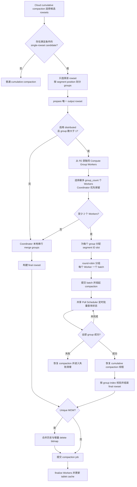
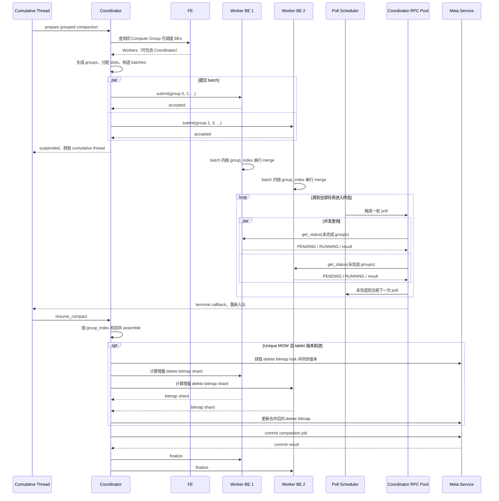
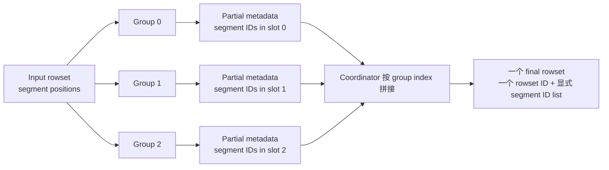

# Distributed Single-Rowset Compaction 当前设计

## 1. 设计目标

Cloud cumulative compaction 可能遇到一个包含大量 overlapping segments 的 rowset。当前设计
先把这个 rowset 划分为多个可独立 merge 的 group，再选择本地串行执行或分发到多个 BE
并行执行。

核心目标只有三个：

- 并行执行 group merge，降低单个 BE 的资源瓶颈。
- 所有 group 最终仍组成一个 output rowset，不改变 compaction 的提交语义。
- Coordinator 统一负责结果组装、MOW delete bitmap 和 Meta Service commit。

## 2. 角色与职责

| 角色 | 核心职责 |
| --- | --- |
| `CloudCumulativeCompaction` | 选择 input rowset，决定普通、本地 grouped 或分布式 grouped 路径 |
| `DistributedCompactionCoordinator` | 发现 Worker、生成任务、分配 segment ID slot、轮询、汇总和 finalize |
| `DistributedCompactionWorker` | merge 一个 group，生成 partial rowset，并保留 MOW 所需状态 |
| FE | 返回同 Compute Group 内可调度的 BE 列表 |
| Meta Service | 管理 compaction job、delete bitmap lock 和最终 commit |

Coordinator BE 也可以作为 Worker。无论 group 在本机还是远端执行，都走相同的 Worker RPC
和任务模型，避免维护两套分布式执行逻辑。

## 3. 核心不变量

1. **只有 Coordinator 提交**：Worker 不提交 rowset，也不修改 tablet 可见状态。
2. **所有 group 共用一个 output rowset ID**：逻辑上始终只有一个输出 rowset。
3. **每个 group 使用独立 segment ID slot**：并行写文件时物理 segment ID 不冲突。
4. **metadata 按 group index 汇总**：完成顺序不影响最终 segment 顺序。
5. **position 与 physical ID 分离**：metadata 数组按 segment position 排列，文件和
   delete bitmap 使用物理 segment ID。

## 4. 总体流程



### 4.1 进入 grouped compaction 的条件

当前实现从 cumulative compaction policy 选出的 rowsets 中寻找一个候选 rowset。候选需要：

- 使用 size-based cumulative compaction policy；
- 没有 delete predicate，且 segments 存在 overlap；
- 表存在 key column，且没有 cluster key；
- overlap 单元数量达到配置阈值。

如果输入已经是 `NONOVERLAPPING_WITHIN_GROUP`，新的 group 按已有 segment groups 合并；
否则按连续 segment position 划分。

## 5. Coordinator 与 Worker 交互



`submit` 只表示 Worker 已接受 batch，不表示 merge 完成。Coordinator 随后依靠主动轮询获取
终态；Worker 不主动推送状态。

## 6. 线程模型

```mermaid
flowchart LR
    subgraph CoordinatorBE[Coordinator BE]
        CP[CumuCompactionTaskThreadPool]
        START[prepare + submit]
        SUSPEND[suspend<br/>释放 cumulative thread]
        TIMER[DistributedCompactionPollScheduler<br/>单个共享 timer 线程]
        RPC[CloudDistributedCompactionRpcThreadPool<br/>并发 control RPC]
        CALLBACK[completion callback]
        RESUME[重新进入 CumuCompactionTaskThreadPool<br/>resume + assemble + commit]

        CP --> START
        START --> SUSPEND
        SUSPEND --> TIMER
        TIMER -->|到达 poll deadline| RPC
        RPC -->|未完成：注册下一次 poll| TIMER
        RPC -->|全部成功或失败| CALLBACK
        CALLBACK --> RESUME
    end

    subgraph WorkerBE[Worker BE，包括可能被选中的 Coordinator BE]
        BRPC[BRPC service]
        HEAVY[HeavyWorkPool<br/>submit / status / finalize]
        WP[CloudDistributedCompactionWorkerThreadPool]
        BATCH[一个 batch 占用一个任务<br/>batch 内 groups 串行]
        STATE[WorkerManager retained state]

        BRPC --> HEAVY
        HEAVY -->|submit batch| WP
        BRPC -->|incremental bitmap| WP
        WP --> BATCH
        BATCH --> STATE
        HEAVY -->|status / finalize| STATE
    end

    START -->|submit RPC| RPC
    RPC --> BRPC
    STATE -->|status response| RPC
    RESUME -->|MOW incremental bitmap RPC| BRPC
```



线程模型的关键点：

- 远端 merge 期间不占用 cumulative compaction 线程；compaction 对象仍保持运行状态并续租。
- 所有分布式 compaction 共享一个 timer 线程，只负责触发到期 callback，不执行 RPC。
- Coordinator 的 submit、status、finalize RPC 由独立 RPC 线程池并发执行。
- 每个 Worker batch 在 Worker compaction 线程池中执行；同一 batch 内的 groups 串行，不同
  Worker BE 可并行。
- Worker 的增量 delete bitmap 请求直接进入 Worker compaction 线程池。

## 7. Group 输出与最终组装

Coordinator 从已经 prepare 的 writer 获取 base segment ID，并为每个 group 预留固定容量的
slot：

```text
slot(group i) = [base + i * capacity, base + (i + 1) * capacity)

示例：base = 10，capacity = 100
group 0 -> [10, 110)
group 1 -> [110, 210)
group 2 -> [210, 310)
```

每个 Worker 创建独立 partial writer：

```text
共享 output rowset ID
独占 group segment ID slot
is_partial_output_writer = true
allow_packed_file = false
```



Coordinator 校验每个 partial rowset 的 rowset ID、slot 边界和 position-aligned metadata，
再依次拼接 segment IDs、row counts、key bounds、file sizes 和 index metadata。多个非空
group 的最终布局为 `NONOVERLAPPING_WITHIN_GROUP`，并记录 `segment_group_sizes`。

## 8. Unique MOW

每个 Worker 只为本 group 的源 segments 创建 ranged `RowIdConversion`：

```text
源 (rowset ID, physical segment ID, row ID)
    -> 目标 (group-local segment position, row ID)
    -> 通过 partial output_segment_ids 解析目标 physical segment ID
```

Merge 时先计算 compaction 快照内的历史 delete bitmap shard。Coordinator assemble 完成后
获取 delete bitmap lock；如果 tablet 版本已经前进，再请求 Workers 使用保留的映射计算增量
shard。Coordinator 合并全部 shards、更新 Meta Service，然后提交 compaction job。

## 9. 回退、失败与清理

- distributed 未启用、group 少于 2、Worker 发现失败或可用 Worker 少于 2 时，在远程任务
  启动前回退到本地串行 grouped compaction。
- 任一远程任务启动后，如果 task 失败、超时或遇到不可恢复的 RPC 错误，整个 compaction
  失败，不再切换到本地路径。
- commit 发出前失败时，finalize 会取消未完成任务并释放 Worker state。
- commit 已发出后，即使返回结果不确定，也按保留输出处理，避免破坏可能已经可见的 rowset。
- Worker 只释放执行状态；远端文件属于 Coordinator prepare 的 rowset，失败后的文件生命周期
  由 compaction job 和 Recycler 管理。
- Worker state 使用 output transaction expiration 作为兜底过期时间。

## 10. 当前边界

- 功能默认关闭，需要同时开启 single-rowset grouped compaction 和 distributed compaction。
- 至少需要两个可调度 Worker；Coordinator 可作为其中之一，并通过本机 BRPC 执行任务。
- Worker 数量不超过 group 数，group 采用 round-robin 分配。
- 同一 Worker 收到的 groups 在一个 batch 内串行执行。
- 当前 merge task 不自动重试；控制 RPC 仅做有限重试。
- segment ID slot capacity 是硬上限，group 输出不能越过自己的 slot。
- 当前不恢复 Coordinator 退出前尚未完成的分布式 compaction。

## 11. 主要代码位置

| 模块 | 文件 |
| --- | --- |
| grouped compaction 选择、本地回退与最终提交 | `be/src/cloud/cloud_cumulative_compaction.cpp` |
| suspend / resume 主流程 | `be/src/cloud/cloud_cumulative_compaction_async.cpp` |
| Coordinator、Poll Scheduler 和 Worker | `be/src/cloud/cloud_distributed_compaction.cpp` |
| RPC service 入口 | `be/src/cloud/cloud_internal_service.cpp` |
| cumulative 与 distributed 线程池 | `be/src/cloud/cloud_storage_engine.cpp` |
| FE Worker 发现 | `fe/fe-core/src/main/java/org/apache/doris/service/FrontendServiceImpl.java` |
